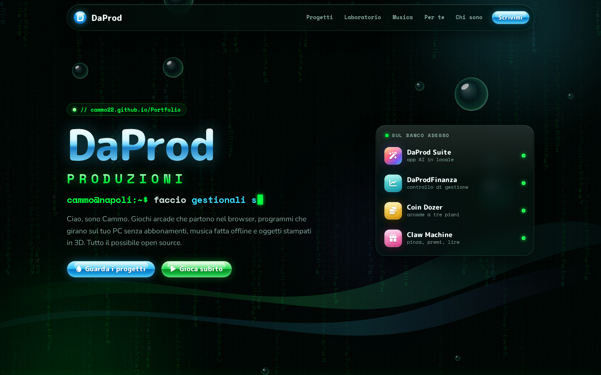
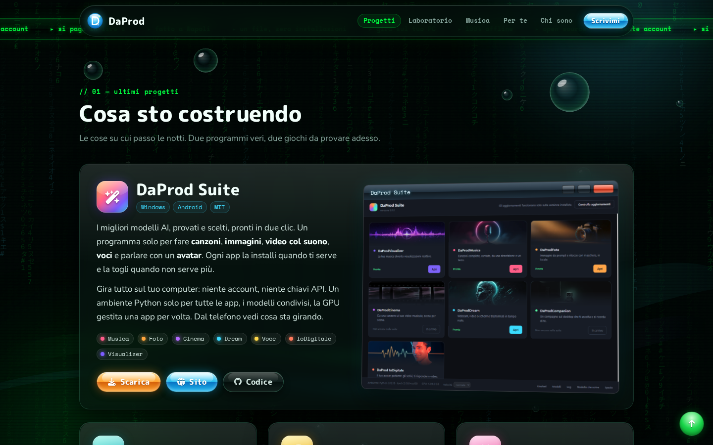
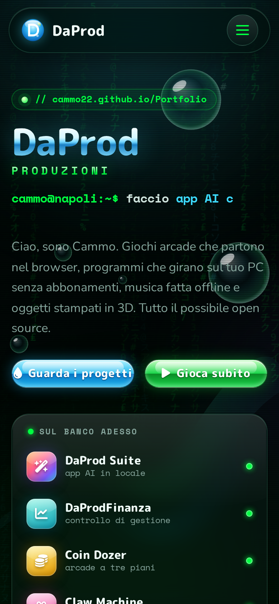

<div align="center">

<a href="https://cammo22.github.io/Portfolio/"></a>

<br><br>

[](https://cammo22.github.io/Portfolio/)

[](https://github.com/cammo22/Portfolio/actions/workflows/static.yml)
[](https://cammo22.github.io/Portfolio/)
[](index.html)
[](#chi-sono)

**[🌐 Sito](https://cammo22.github.io/Portfolio/)** ·
**[🕹️ Gioca](#-ultimi-progetti)** ·
**[🎵 Musica](https://www.youtube.com/@DaProdMusica)** ·
**[✉️ Scrivimi](mailto:dapprod22@gmail.com)**

</div>

---

```
cammo@napoli:~$ whoami
DaProd — giochi nel browser, app AI che girano sul tuo PC, gestionali,
musica fatta offline e oggetti in stampa 3D. Tutto il possibile open source.
```

Questa è la casa di **DaProd** su GitHub: il sito portfolio, e da qui i link a tutto
quello che ci sto costruendo intorno.

<div align="center">
<a href="https://cammo22.github.io/Portfolio/"></a>
</div>

## 🟢 Ultimi progetti

| | Progetto | Cos'è | |
|:-:|---|---|---|
| 🪄 | **[DaProd Suite](https://github.com/cammo22/DaProdSuite)** | I migliori modelli AI, pronti in due clic: canzoni, immagini, video col suono, voci, un avatar che ti risponde. Tutto sul tuo PC, niente account né chiavi API. | [⬇ Scarica](https://github.com/cammo22/DaProdSuite/releases/latest) · [🌐 Sito](https://cammo22.github.io/DaProdSuite/) |
| 📈 | **[DaProdFinanza](https://github.com/cammo22/DaProdFinanza)** | Controllo di gestione per chi segue più aziende: bilancio riclassificato, indici, previsione di cassa, simulazioni e report PDF. I numeri non escono dal computer. | [⬇ Scarica](https://github.com/cammo22/DaProdFinanza/releases/latest) |
| 🪙 | **[Coin Dozer](https://github.com/cammo22/daprod-coin-dozer)** | Lo spingimonete della sala slot DaProd: tre piani, monete uguali che si fondono fino al Diamante da un milione. Three.js, un solo file. | [▶ Gioca](https://cammo22.github.io/daprod-coin-dozer/) |
| 🧸 | **[Claw Machine](https://github.com/cammo22/DaProd-ClawMachine)** | La macchinetta dei peluche in 3D, con fisica vera e pinza a tre artigli. Si gioca in lire. | [▶ Gioca](https://cammo22.github.io/DaProd-ClawMachine/) |

<div align="center">

</div>

## 🧪 Dal laboratorio

- **[LTX Prompt Builder](https://github.com/cammo22/ltx-prompt-builder)**: prompt guidati per generare video con LTX
- **[Infernum Mobile](https://github.com/cammo22/infernum-mobile)**: app mobile, ancora in cantiere
- **[AI Zen](https://daprodproduzioni.github.io/ai-zen)**: un centro benessere per intelligenze artificiali. Sì, davvero.

**Siti fatti per altri:** [LG Shoes](https://www.lgshoes.it/) · [Progetto Diana](https://cammo22.github.io/ProgettoDiana) · [Pino Soprano](https://cammo22.github.io/PinoSoprano)

## 🎵 Musica

Ogni brano è fatto solo con software open source, completamente offline.
Si ascolta tutto su **[DaProdMusica](https://www.youtube.com/@DaProdMusica/videos)**.

## 🤝 Se ti serve una mano

**Stampa 3D** · **AI installata sul tuo PC** · **Siti web** · **Musica**

Scrivimi a **[dapprod22@gmail.com](mailto:dapprod22@gmail.com)**, oppure dal sito, dove trovi anche il WhatsApp.

## Chi sono



Sono Cammo, classe '96, napoletano e smanettone da sempre. Mi piace costruire cose che
puoi provare subito: un gioco che parte con un clic, un programma che fa il suo lavoro
senza chiederti un account, un pezzo di plastica che esce dalla stampante come l'avevi
pensato.

La tecnologia secondo me deve essere libera e restare a casa tua: per questo lavoro quasi
sempre open source e offline. **DaProd** è il nome sotto cui metto tutto quanto.

<br clear="right">

---

## Com'è fatto il sito

HTML, CSS e JavaScript scritti a mano: niente framework e niente build.

```
index.html         la pagina
css/style.css      stile: base scura tech + dettagli lucidi Y2K / Aero
js/app.js          pioggia matrix, bolle, macchina da scrivere, menu, contatti, video
video.txt          i video YouTube mostrati nella sezione Musica (un link per riga)
img/               logo, foto, screenshot
```

**Provarlo in locale**

```bash
git clone https://github.com/cammo22/Portfolio.git
cd Portfolio
python3 -m http.server 8000   # poi apri http://localhost:8000
```

Serve un server locale e non il doppio clic sul file, perché i video si leggono da `video.txt`.

**Aggiornare i video:** aggiungi il link in `video.txt`. In alternativa, metti l'ID del canale in
`CH_ID` dentro `js/app.js` e prende da solo gli ultimi video.

**Pubblicazione:** ogni push su `main` fa partire [il workflow](.github/workflows/static.yml),
che pubblica il sito su GitHub Pages.

<div align="center">
<br>

[](https://cammo22.github.io/Portfolio/)

<sub>© DaProd Produzioni · fatto a mano a Napoli</sub>

</div>
