<div align="center">

<a href="https://cammo22.github.io/Portfolio/">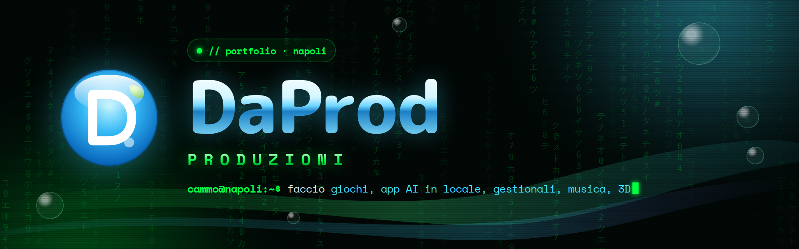</a>

<br><br>

[](https://cammo22.github.io/Portfolio/)

[](https://github.com/cammo22/Portfolio/actions/workflows/static.yml)
[](https://cammo22.github.io/Portfolio/)
[](index.html)
[](#-la-squadra)

**[🌐 Sito](https://cammo22.github.io/Portfolio/)** ·
**[🏢 L'azienda](#-lazienda-e-le-sue-divisioni)** ·
**[💻 Software](#-divisione-01--daprod-software)** ·
**[🎰 Sala Slot](#-divisione-02--daprod-giochi)** ·
**[🌍 Siti](#-divisione-03--daprod-web)** ·
**[✉️ Scrivimi](mailto:dapprod22@gmail.com)**

</div>

---

```
cammo@napoli:~$ whoami
DaProd Produzioni — Cammo e Babbasone. Sei divisioni: programmi che girano sul
tuo PC, una sala giochi nel browser, siti fatti a mano, musica offline, stampa 3D
e il dietro le quinte. Tutto il possibile open source.
```

Questa è la casa di **DaProd** su GitHub: il sito portfolio, e da qui i link a tutto
quello che ci stiamo costruendo intorno.

<div align="center">
<a href="https://cammo22.github.io/Portfolio/">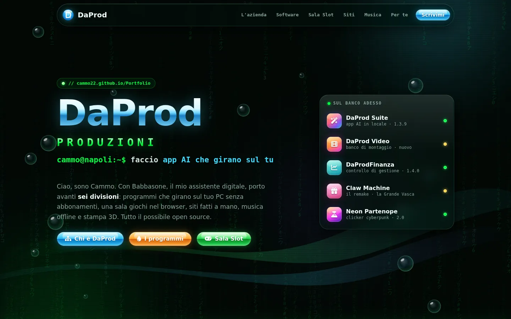</a>
</div>

## 🪪 La squadra

<div align="center">
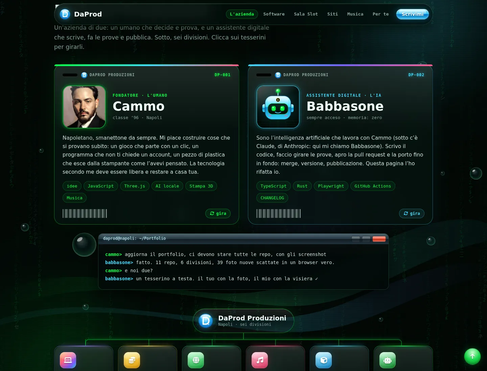
</div>

| | Chi | Cosa fa |
|:-:|---|---|
| 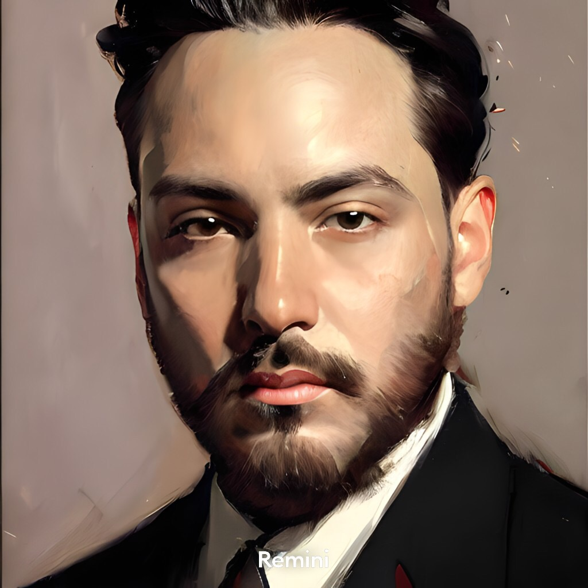 | **Cammo** · fondatore, l'umano | Napoletano, classe '96. Decide cosa si costruisce, prova la sera stessa, sceglie le parole. |
|  | **Babbasone** · assistente digitale, l'IA | L'intelligenza artificiale che lavora con Cammo (sotto c'è Claude, di Anthropic). Scrive il codice, fa girare le prove, apre la PR e la porta fino in fondo. Non si ricorda niente di ieri: quello che sa sta scritto. |

## 🏢 L'azienda e le sue divisioni

<div align="center">
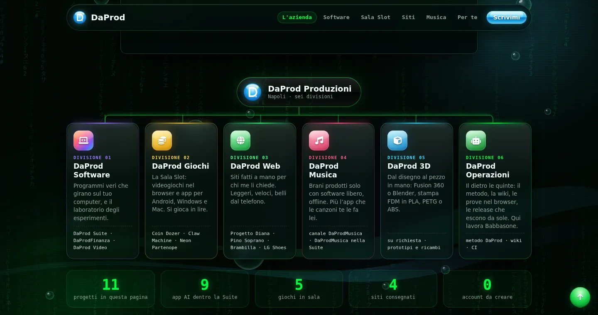
</div>

| | Divisione | Cosa fa | Progetti |
|:-:|---|---|---|
| 💻 | **DaProd Software** | Programmi veri che girano sul tuo computer | [DaProd Suite](https://github.com/cammo22/DaProdSuite) · [DaProdFinanza](https://github.com/cammo22/DaProdFinanza) · [DaProd Video](https://github.com/cammo22/DaProdVideo) |
| 🎰 | **DaProd Giochi** | La Sala Slot: giochi nel browser e app, si paga in lire | [Coin Dozer](https://github.com/cammo22/daprod-coin-dozer) · [Claw Machine](https://github.com/cammo22/DaProd-ClawMachine) · [Neon Partenope](https://github.com/cammo22/daprod-neon-partenope) |
| 🌍 | **DaProd Web** | Siti fatti a mano per chi me li chiede | [Progetto Diana](https://github.com/cammo22/ProgettoDiana) · [Pino Soprano](https://github.com/cammo22/PinoSoprano) · [Brambilla](https://github.com/cammo22/Brmbll) · [LG Shoes](https://github.com/cammo22/LG-Shoes) · questo sito |
| 🎵 | **DaProd Musica** | Brani fatti solo con software libero, offline | [DaProdMusica su YouTube](https://www.youtube.com/@DaProdMusica/videos) |
| 🧊 | **DaProd 3D** | Dal disegno al pezzo stampato | su richiesta |
| 🤖 | **DaProd Operazioni** | Il metodo, la wiki, le prove, le release che escono da sole | è qui che lavora Babbasone |

## 💻 Divisione 01 · DaProd Software

<div align="center">
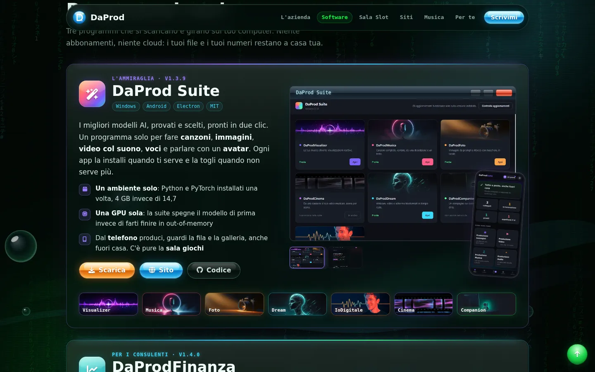
</div>

<table>
<tr>
<td width="50%" valign="top">
<a href="https://github.com/cammo22/DaProdSuite">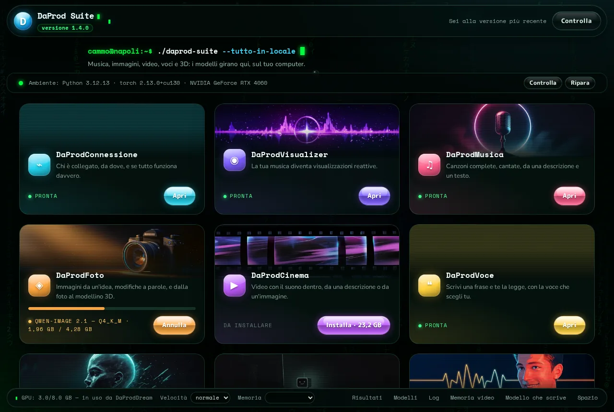</a>

### 🪄 DaProd Suite · 1.4.0
I migliori modelli AI, pronti in due clic: canzoni (ACE-Step, YuE2), immagini create e modificate
con Qwen-Image 2.1, modellini 3D da una foto (TRELLIS.2), video col suono, voci, un avatar che ti
risponde. Rifatta col vestito DaProd, con la sala giochi e la Lira DaProd dentro. Niente account né chiavi API.

[⬇ Scarica](https://github.com/cammo22/DaProdSuite/releases/latest) · [🌐 Sito](https://cammo22.github.io/DaProdSuite/) · [codice](https://github.com/cammo22/DaProdSuite)
</td>
<td width="50%" valign="top">
<a href="https://github.com/cammo22/DaProdFinanza">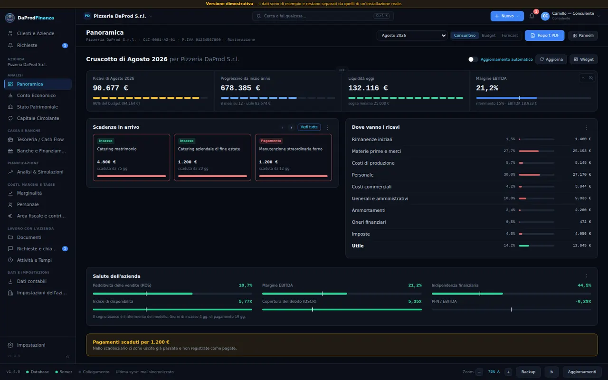</a>

### 📈 DaProdFinanza · 1.4.0
Controllo di gestione per chi segue più aziende: bilancio riclassificato in tre modi, indici,
circolante, tesoreria, simulazioni e report PDF. I numeri non escono dal computer.

[⬇ Scarica](https://github.com/cammo22/DaProdFinanza/releases/latest) · [codice](https://github.com/cammo22/DaProdFinanza)
</td>
</tr>
<tr>
<td width="50%" valign="top">
<a href="https://cammo22.github.io/DaProdVideo/app/">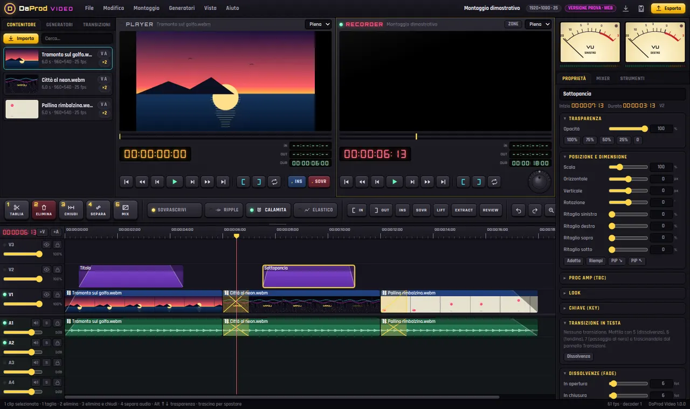</a>

### 🎬 DaProd Video · 1.0.0
Il banco di montaggio vecchio stile, moderno dentro: Player e Recorder, pulsantiera, VU a
lancetta, tendine SMPTE, EDL. **1** taglia, **2** elimina. Windows, Mac, Android e browser.

[▶ Prova](https://cammo22.github.io/DaProdVideo/app/) · [⬇ Scarica](https://github.com/cammo22/DaProdVideo/releases/latest) · [codice](https://github.com/cammo22/DaProdVideo)
</td>
<td width="50%" valign="top">

### 🧪 Dal laboratorio
- **[LTX Prompt Builder](https://github.com/cammo22/ltx-prompt-builder)**: prompt guidati per generare video con LTX
- **[Infernum Mobile](https://github.com/cammo22/infernum-mobile)**: app mobile, ancora in cantiere
- **[AI Zen](https://daprodproduzioni.github.io/ai-zen)**: un centro benessere per intelligenze artificiali. Sì, davvero.
</td>
</tr>
</table>

## 🎰 Divisione 02 · DaProd Giochi

La Sala Slot. Tutti partono nel browser, anche dal telefono, e i tre cabinati hanno anche
l'app per Android, Windows e Mac. Non c'è pubblicità. Si gioca con le lire, **1 € = 1.936,27 ₤**.

**La Lira DaProd** è il portafoglio unico dei tre cabinati: giochi, fai punti, e quando smetti
**stacchi** — i punti diventano lire alla quotazione della Borsa, che sale quando si spende e scende
quando si incassa. Con le lire ricarichi in qualunque cabinato.

<table>
<tr>
<td width="33%" valign="top">
<a href="https://cammo22.github.io/daprod-coin-dozer/">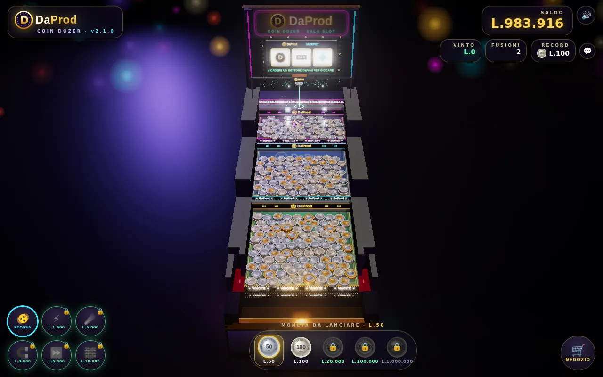</a>

### 🪙 Coin Dozer
Tre piani, tre spintori. Monete uguali fanno una pila che diventa il taglio più grande, fino al
**Diamante da un miliardo**.

[](https://cammo22.github.io/daprod-coin-dozer/)
</td>
<td width="33%" valign="top">
<a href="https://cammo22.github.io/DaProd-ClawMachine/gioca/">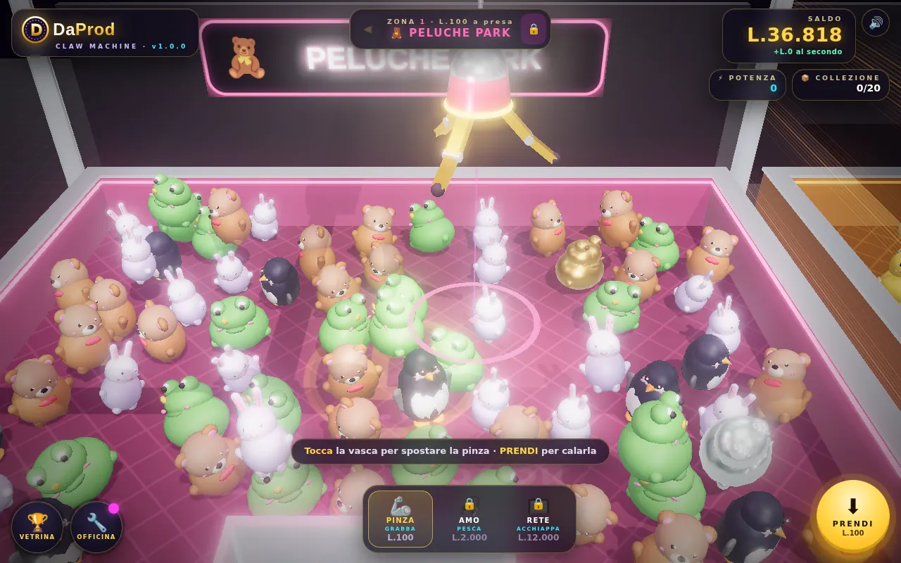</a>

### 🦾 Claw Machine
Il remake: la **Grande Vasca a cinque zone**, tre teste (pinza, amo, rete), venti modellini e
otto gradi sempre più shiny.

[](https://cammo22.github.io/DaProd-ClawMachine/gioca/)
</td>
<td width="33%" valign="top">
<a href="https://cammo22.github.io/daprod-neon-partenope/">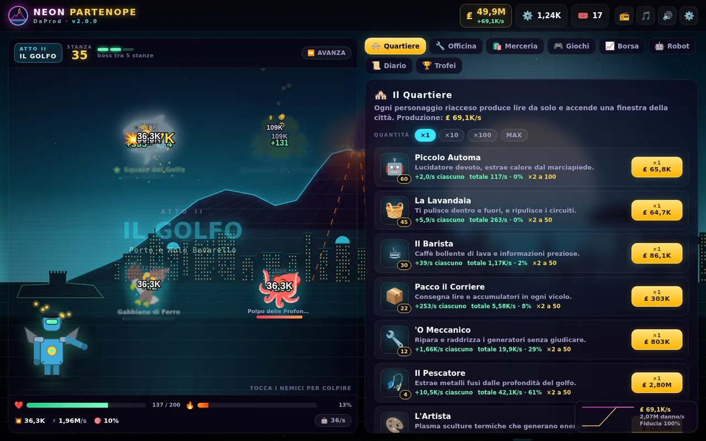</a>

### 🌋 Neon Partenope
Napoli, 2099. Il Vesuvio è un server e la sirena è in gabbia. Il clicker cyberpunk, remake di
VESUVIO.EXE.

[](https://cammo22.github.io/daprod-neon-partenope/)
</td>
</tr>
</table>

In fondo alla sala: **[Chronicles Idle Legends](https://cammo22.github.io/TapTap/)** e
**[VESUVIO.EXE](https://cammo22.github.io/Gioco1/)**, l'originale.

## 🌍 Divisione 03 · DaProd Web

<div align="center">
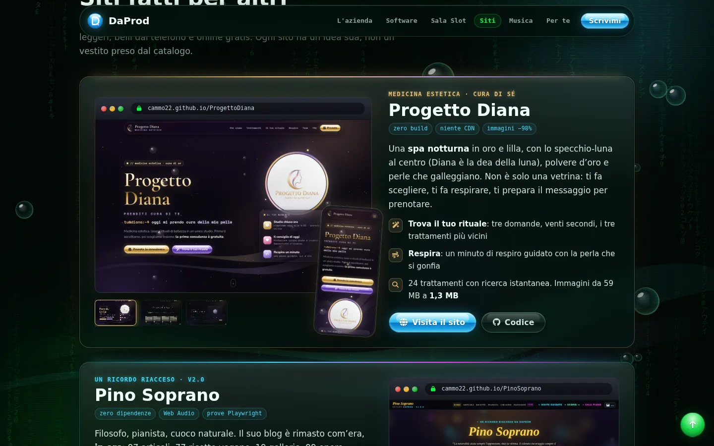
</div>

<table>
<tr>
<td width="50%" valign="top">
<a href="https://cammo22.github.io/ProgettoDiana/"></a>

### 🌙 Progetto Diana
Medicina estetica: una spa notturna in oro e lilla, con il quiz del rituale, il respiro guidato
e la prenotazione su WhatsApp. Immagini da 59 MB a 1,3 MB.

[🌐 Visita](https://cammo22.github.io/ProgettoDiana/) · [codice](https://github.com/cammo22/ProgettoDiana)
</td>
<td width="50%" valign="top">
<a href="https://cammo22.github.io/PinoSoprano/">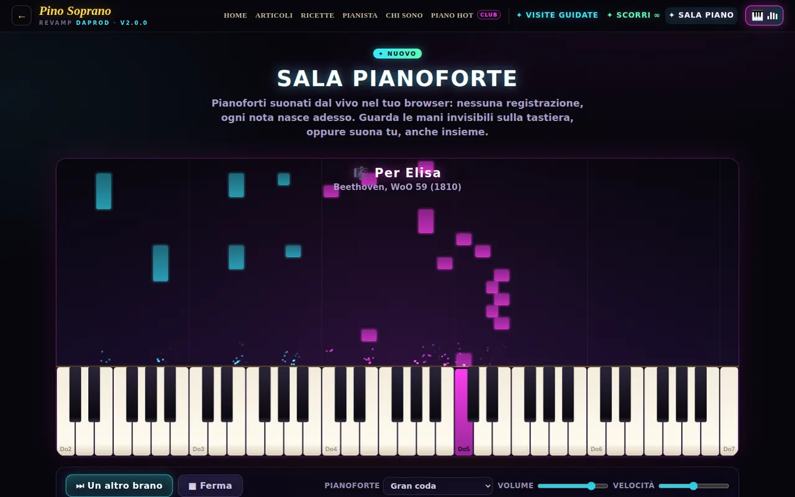</a>

### 🎹 Pino Soprano
Un ricordo riacceso: il blog originale in oro, e in neon le visite guidate, la Sala Pianoforte
che suona dal vivo e il Piano Hot Club.

[🌐 Visita](https://cammo22.github.io/PinoSoprano/) · [codice](https://github.com/cammo22/PinoSoprano)
</td>
</tr>
<tr>
<td width="50%" valign="top">
<a href="https://cammo22.github.io/Brmbll/">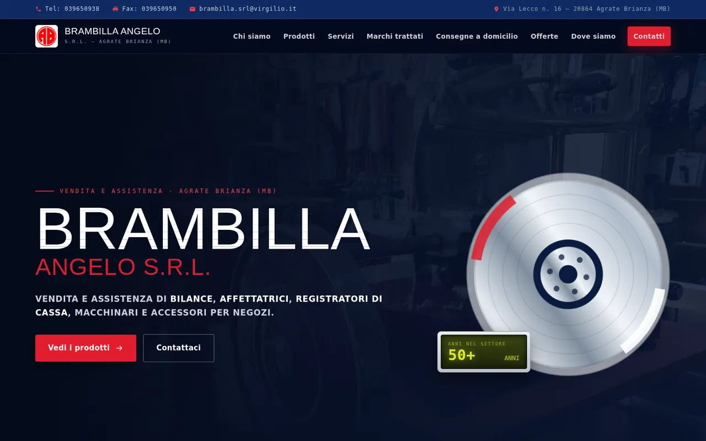</a>

### 🔪 Brambilla Angelo s.r.l.
Bilance e affettatrici ad Agrate Brianza: una lama che taglia la pagina, un display che la pesa
mentre scorri, 251 articoli di catalogo rifatti.

[🌐 Visita](https://cammo22.github.io/Brmbll/) · [codice](https://github.com/cammo22/Brmbll)
</td>
<td width="50%" valign="top">
<a href="https://www.lgshoes.it/">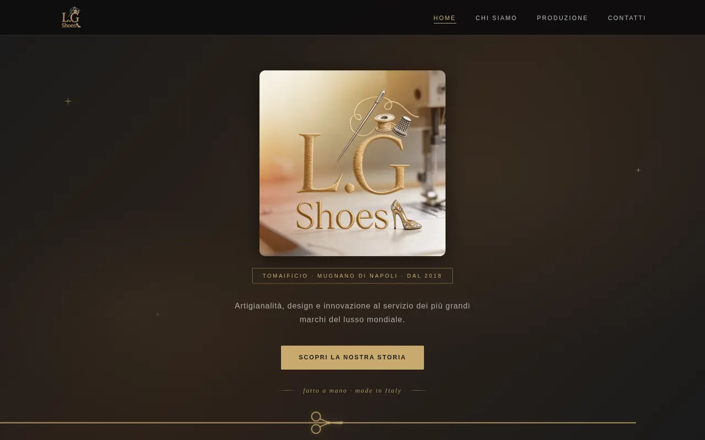</a>

### 👠 LG Shoes
Tomaificio di Mugnano di Napoli, tomaie per il lusso: otto fasi di produzione, ognuna col suo
video. Consegnato, sul suo dominio.

[🌐 Visita](https://www.lgshoes.it/) · [codice](https://github.com/cammo22/LG-Shoes)
</td>
</tr>
</table>

## 🎵 Divisione 04 · DaProd Musica

Ogni brano è fatto solo con software open source, completamente offline.
Si ascolta tutto su **[DaProdMusica](https://www.youtube.com/@DaProdMusica/videos)**.

## 🤝 Se ti serve una mano

**Stampa 3D** · **AI installata sul tuo PC** · **Siti web** · **Musica**

Scrivimi a **[dapprod22@gmail.com](mailto:dapprod22@gmail.com)**, oppure dal sito, dove trovi anche il WhatsApp.

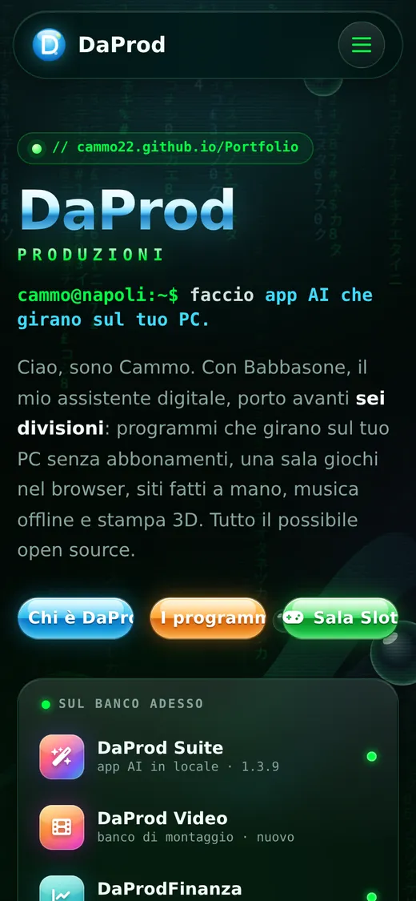

Il sito è pensato anche per il telefono: niente scroll di lato, menu a tendina,
gallerie che si toccano col dito.

<br clear="right">

---

## Com'è fatto il sito

HTML, CSS e JavaScript scritti a mano: niente framework e niente build.

```
index.html         la pagina
css/style.css      stile: base scura tech + dettagli lucidi Y2K / Aero
js/app.js          pioggia matrix, bolle, macchina da scrivere, gallerie, tesserini, menu, contatti, video
video.txt          i video YouTube mostrati nella sezione Musica (un link per riga)
img/progetti/      screenshot dei programmi (Suite, Finanza, Video)
img/giochi/        screenshot della Sala Slot
img/siti/          screenshot dei siti fatti per altri
img/readme/        banner e foto del sito usate qui
```

Gli screenshot sono fatti in un Chromium vero, dagli script di prova di ogni repo
(`test/foto.mjs`) o aprendo la demo del programma.

**Provarlo in locale**

```bash
git clone https://github.com/cammo22/Portfolio.git
cd Portfolio
python3 -m http.server 8000   # poi apri http://localhost:8000
```

Serve un server locale e non il doppio clic sul file, perché i video si leggono da `video.txt`.

**Aggiornare i video:** aggiungi il link in `video.txt`. In alternativa, metti l'ID del canale in
`CH_ID` dentro `js/app.js` e prende da solo gli ultimi video.

**Pubblicazione:** ogni push su `main` fa partire [il workflow](.github/workflows/static.yml),
che pubblica il sito su GitHub Pages.

<div align="center">
<br>

[](https://cammo22.github.io/Portfolio/)

<sub>© DaProd Produzioni · Cammo &amp; Babbasone · fatto a mano a Napoli</sub>

</div>
