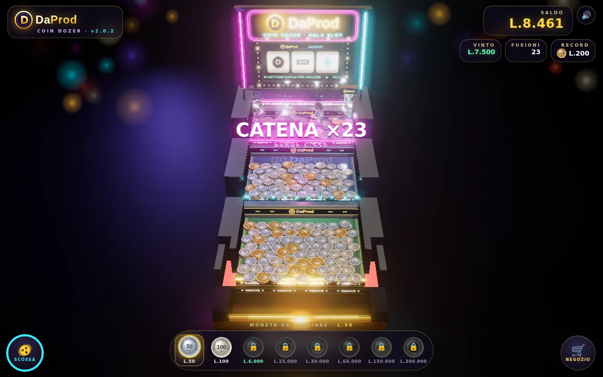
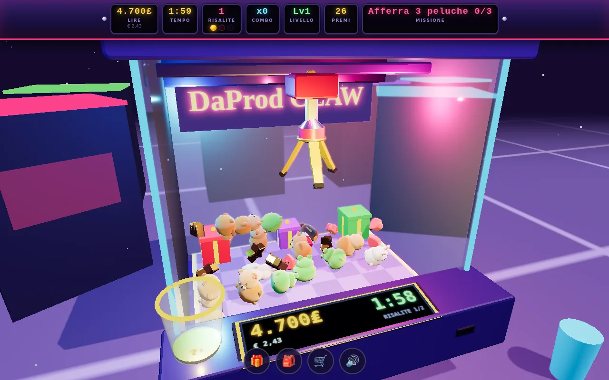
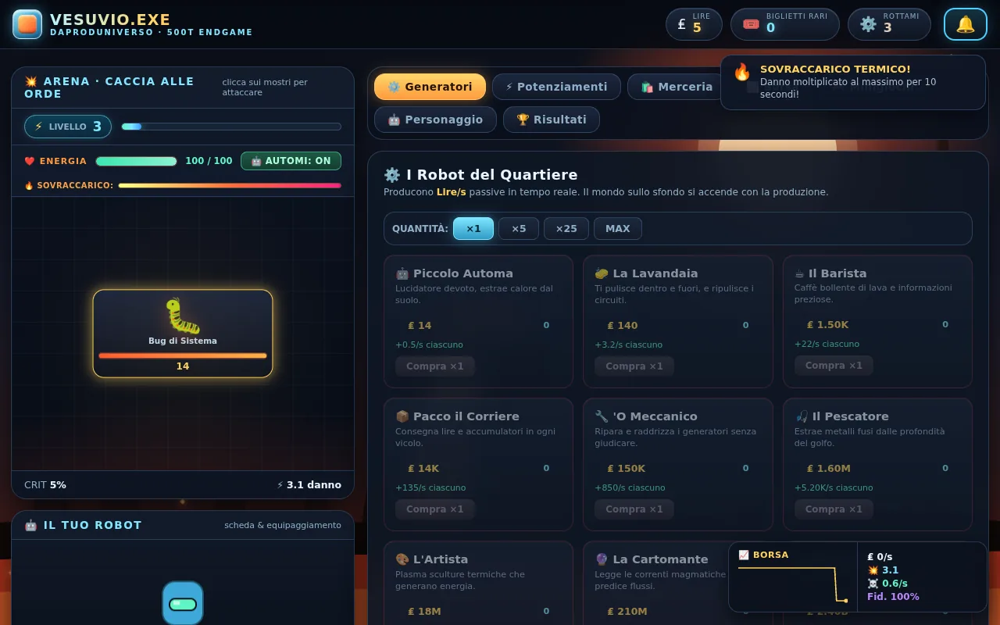
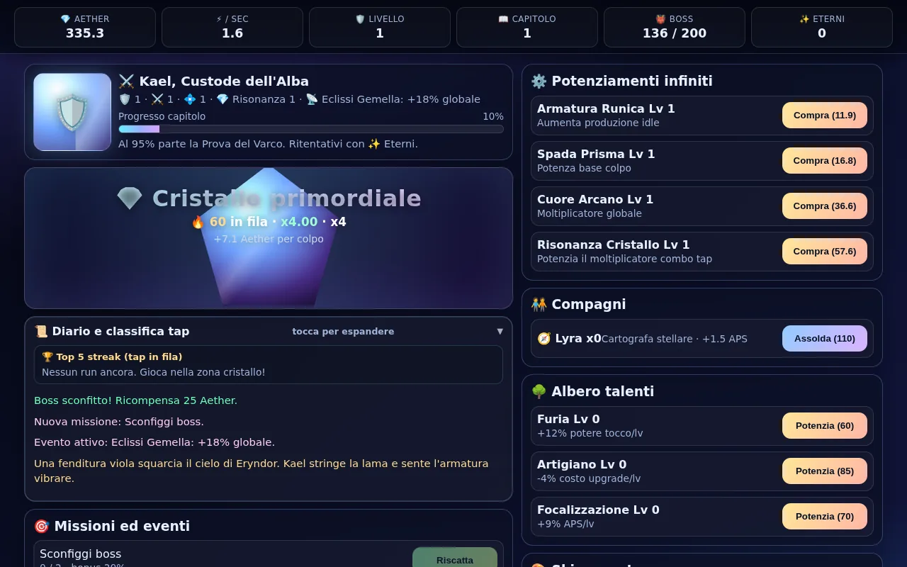

<div align="center">

<a href="https://cammo22.github.io/Portfolio/"></a>

<br><br>

[](https://cammo22.github.io/Portfolio/)

[](https://github.com/cammo22/Portfolio/actions/workflows/static.yml)
[](https://cammo22.github.io/Portfolio/)
[](index.html)
[](#chi-sono)

**[🌐 Sito](https://cammo22.github.io/Portfolio/)** ·
**[🎰 Sala Slot](#-sala-slot-daprod)** ·
**[🎵 Musica](https://www.youtube.com/@DaProdMusica)** ·
**[✉️ Scrivimi](mailto:dapprod22@gmail.com)**

</div>

---

```
cammo@napoli:~$ whoami
DaProd — giochi nel browser, app AI che girano sul tuo PC, gestionali,
musica fatta offline e oggetti in stampa 3D. Tutto il possibile open source.
```

Questa è la casa di **DaProd** su GitHub: il sito portfolio, e da qui i link a tutto
quello che ci sto costruendo intorno.

<div align="center">
<a href="https://cammo22.github.io/Portfolio/"></a>
</div>

## 🟢 Ultimi progetti

| | Progetto | Cos'è | |
|:-:|---|---|---|
| 🪄 | **[DaProd Suite](https://github.com/cammo22/DaProdSuite)** | I migliori modelli AI, pronti in due clic: canzoni, immagini, video col suono, voci, un avatar che ti risponde. Tutto sul tuo PC, niente account né chiavi API. | [⬇ Scarica](https://github.com/cammo22/DaProdSuite/releases/latest) · [🌐 Sito](https://cammo22.github.io/DaProdSuite/) |
| 📈 | **[DaProdFinanza](https://github.com/cammo22/DaProdFinanza)** | Controllo di gestione per chi segue più aziende: bilancio riclassificato, indici, previsione di cassa, simulazioni e report PDF. I numeri non escono dal computer. | [⬇ Scarica](https://github.com/cammo22/DaProdFinanza/releases/latest) |
| 🎰 | **[Sala Slot DaProd](#-sala-slot-daprod)** | Quattro videogiochi da giocare subito nel browser, anche dal telefono. Si paga in lire. | [▶ Entra](#-sala-slot-daprod) |

<div align="center">

</div>

## 🎰 Sala Slot DaProd

La mia sala giochi. Tutti partono nel browser, anche dal telefono. Non c'è niente da scaricare
e non c'è pubblicità. Si gioca con le lire, **1 € = 1.936,27 ₤**.

<table>
<tr>
<td width="50%" valign="top">
<a href="https://cammo22.github.io/daprod-coin-dozer/"></a>

### 🪙 Coin Dozer
Una macchina a **tre piani** con tre spintori. Due monete uguali una sopra l'altra si fondono nel
taglio più grande, anche a catena, fino al **Diamante da L.1 milione**. Il gettone DaProd fa girare
lo slot, e con tre loghi arriva il **JACKPOT**.

[](https://cammo22.github.io/daprod-coin-dozer/) [codice](https://github.com/cammo22/daprod-coin-dozer)
</td>
<td width="50%" valign="top">
<a href="https://cammo22.github.io/DaProd-ClawMachine/"></a>

### 🧸 Claw Machine
La macchinetta dei peluche in 3D, con vetro vero, **pinza a tre artigli** e premi che si impilano
con la fisica (cannon-es). Costa **100₤** a partita e hai due minuti. Ci sono missioni, combo, il
negozio e il bicchierone dei premi.

[](https://cammo22.github.io/DaProd-ClawMachine/) [codice](https://github.com/cammo22/DaProd-ClawMachine)
</td>
</tr>
<tr>
<td width="50%" valign="top">
<a href="https://cammo22.github.io/Gioco1/"></a>

### 🌋 VESUVIO.EXE
Un clicker nella Ponticelli cyberpunk. Ci sono mostri e boss da battere, i robot del quartiere che
lavorano per te e la **Borsa del Golfo** da seguire in tempo reale.

[](https://cammo22.github.io/Gioco1/) [codice](https://github.com/cammo22/Gioco1)
</td>
<td width="50%" valign="top">
<a href="https://cammo22.github.io/TapTap/"></a>

### 💎 Chronicles Idle Legends
Sei Kael, Custode dell'Alba. Tocchi il **Cristallo primordiale** per far salire la combo, poi
sconfiggi i boss, assoldi compagni e fai crescere l'albero dei talenti.

[](https://cammo22.github.io/TapTap/) [codice](https://github.com/cammo22/TapTap)
</td>
</tr>
</table>

## 🧪 Dal laboratorio

- **[LTX Prompt Builder](https://github.com/cammo22/ltx-prompt-builder)**: prompt guidati per generare video con LTX
- **[Infernum Mobile](https://github.com/cammo22/infernum-mobile)**: app mobile, ancora in cantiere
- **[AI Zen](https://daprodproduzioni.github.io/ai-zen)**: un centro benessere per intelligenze artificiali. Sì, davvero.

**Siti fatti per altri:** [LG Shoes](https://www.lgshoes.it/) · [Progetto Diana](https://cammo22.github.io/ProgettoDiana) · [Pino Soprano](https://cammo22.github.io/PinoSoprano)

## 🎵 Musica

Ogni brano è fatto solo con software open source, completamente offline.
Si ascolta tutto su **[DaProdMusica](https://www.youtube.com/@DaProdMusica/videos)**.

## 🤝 Se ti serve una mano

**Stampa 3D** · **AI installata sul tuo PC** · **Siti web** · **Musica**

Scrivimi a **[dapprod22@gmail.com](mailto:dapprod22@gmail.com)**, oppure dal sito, dove trovi anche il WhatsApp.

## Chi sono


Sono Cammo, classe '96, napoletano e smanettone da sempre. Mi piace costruire cose che
puoi provare subito: un gioco che parte con un clic, un programma che fa il suo lavoro
senza chiederti un account, un pezzo di plastica che esce dalla stampante come l'avevi
pensato.

La tecnologia secondo me deve essere libera e restare a casa tua: per questo lavoro quasi
sempre open source e offline. **DaProd** è il nome sotto cui metto tutto quanto.

<br clear="right">

---

## Com'è fatto il sito

HTML, CSS e JavaScript scritti a mano: niente framework e niente build.

```
index.html         la pagina
css/style.css      stile: base scura tech + dettagli lucidi Y2K / Aero
js/app.js          pioggia matrix, bolle, macchina da scrivere, menu, contatti, video
video.txt          i video YouTube mostrati nella sezione Musica (un link per riga)
img/               logo, foto, screenshot (giochi in img/giochi/)
```

**Provarlo in locale**

```bash
git clone https://github.com/cammo22/Portfolio.git
cd Portfolio
python3 -m http.server 8000   # poi apri http://localhost:8000
```

Serve un server locale e non il doppio clic sul file, perché i video si leggono da `video.txt`.

**Aggiornare i video:** aggiungi il link in `video.txt`. In alternativa, metti l'ID del canale in
`CH_ID` dentro `js/app.js` e prende da solo gli ultimi video.

**Pubblicazione:** ogni push su `main` fa partire [il workflow](.github/workflows/static.yml),
che pubblica il sito su GitHub Pages.

<div align="center">
<br>

[](https://cammo22.github.io/Portfolio/)

<sub>© DaProd Produzioni · fatto a mano a Napoli</sub>

</div>
